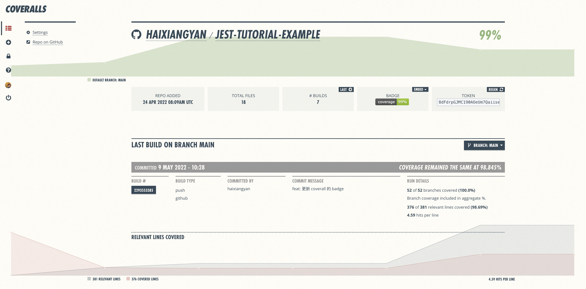
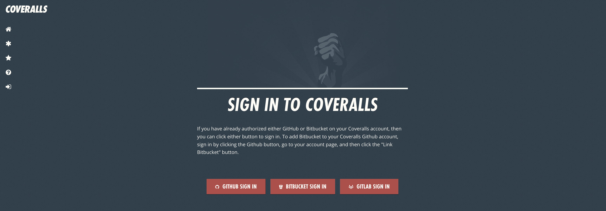
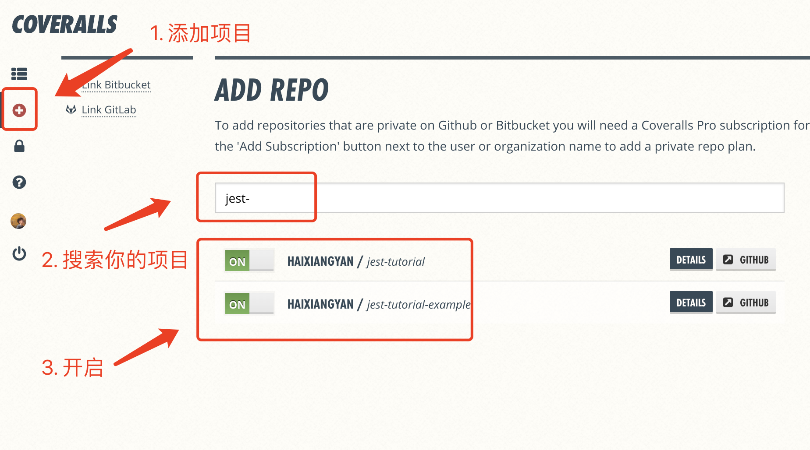
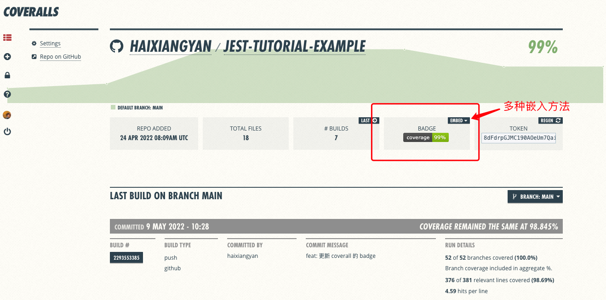

# 自动化测试

在每次开发完代码都手动 `npm run test` 是非常痛苦的，在真实业务中，我们一般把执行测试这一步放到流水线中。这也是前端工程化非常重要的一步，称为 “自动化测试”。

关于项目流水线配置，每个公司都有自己的对应工具。而 Github 也推出了自己的项目流水线工具—— [Github Actions](https://github.com/features/actions) 。这一章，就带大家一起配置一下吧。


## Github Actions

在根目录添加 `.github/workflows/node.js.yml`：

```yml
name: Node.js CI

on:
  push:
    branches: [ main ]
  pull_request:
    branches: [ main ]

jobs:
  build:

    runs-on: ubuntu-latest

    strategy:
      matrix:
        node-version: [16.x]
        # See supported Node.js release schedule at https://nodejs.org/en/about/releases/

    steps:
    - uses: actions/checkout@v3
    - name: Use Node.js ${{ matrix.node-version }}
      uses: actions/setup-node@v3
      with:
        node-version: ${{ matrix.node-version }}
    - run: npm install
    - run: npm test
```

这里 `on` 会监听 `main` 分支的 `git push` 和 PR 提交两个操作。开发者在 `main` 分支推代码或者 PR 合并都会执行下面配置的 `jobs`。

下面的 `jobs` 也很好理解，就是执行一些 `bash` 脚本。（如果 Gtihub Actions 能用可视化界面来让开发者配置流水线会更好一点）

现在把代码推到 `main`，会发现 Github Actions 开始执行，并成功。

## Coveralls

还记得刚开始时我们配置了 Jest 生成覆盖率文件么？如果能在一个平台能实时看到每次执行测试后的结果那就更好了。

比较著名的测试平台有 [Coveralls](https://coveralls.io/)，它能够读取生成的 `lcov.info` 测试覆盖率文件，以可视化的方法展示出来：



首先在 [Coveralls 官网](https://coveralls.io/sign-in) 用 Github 账号登入：



接下来，添加你的 Github 项目：



添加完项目并没有结束，如果你使用 [Travis CI](https://travis-ci.org/) 你可能要手动写命令找到 `lcov.info` 传给 Coveralls。而 Github Actions 里有 Coveralls 组件，使用它就能自动完成：

```yaml
name: Node.js CI

on:
  push:
    branches: [ main ]
  pull_request:
    branches: [ main ]

jobs:
  build:

    runs-on: ubuntu-latest

    strategy:
      matrix:
        node-version: [16.x]
        # See supported Node.js release schedule at https://nodejs.org/en/about/releases/

    steps:
    - uses: actions/checkout@v3
    - name: Use Node.js ${{ matrix.node-version }}
      uses: actions/setup-node@v3
      with:
        node-version: ${{ matrix.node-version }}
    - run: npm install
    - run: npm test
    
    - name: Coveralls
      uses: coverallsapp/github-action@master
      with:
        github-token: ${{ secrets.GITHUB_TOKEN }}
```

再次把代码推到 `main` 分支，等上一会，就可以在 [Coveralls 项目列表页](https://coveralls.io/repos) 看到你的测试覆盖率情况了。

一旦把测试报告推到 Coveralls，你可以在项目详情页处找到这个 Badge：



点击 `embed` 可以看到有多种嵌入方法，一般会把这个 Badge 放到 `README.md`，让项目看起来更有逼格：

[](https://coveralls.io/github/haixiangyan/jest-tutorial-example?branch=main)

## 总结

这一章我们学会了如何配置 Github Actions，在每次推代码和合并 PR 时自动跑测试。同时通过 `coverallsapp/github-action@master` 组件把测试覆盖率报告发给 Coveralls，将测试情况可视化。
