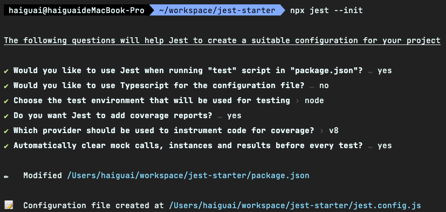
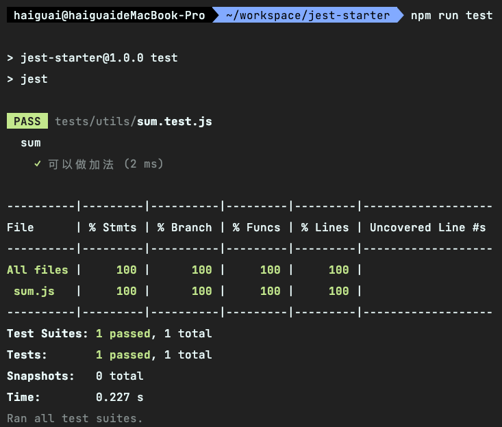

# 起步

首先，我们来创建一个新项目。

## 创建项目

使用 `npm` 初始化，并安装 `jest`。

```shell
# 创建项目
mkdir jest-starter
cd jest-starter

# 初始化
npm init -y

# 安装依赖
npm i -D jest
```

然后，用 `jest-cli` 初始化 `jest` 配置文件，这样就不用我们一个一个去文档找了：

```shell
npx jest --init
```

第一次初始化 Jest，可能会有点纠结，可以先按我下面的来选择，只打开覆盖率和自动清除 Mock，别的以后再说：



执行完之后，就会看到有一个 `jest.config.js` 的配置文件：

```shell
module.exports = {
  // 自动清除 Mock
  clearMocks: true,

  // 开启覆盖率
  collectCoverage: true,

  // 指定生成覆盖率报告文件存放位置
  coverageDirectory: "coverage",

  // 不用管
  coverageProvider: "v8",
};
```

## 第一个测试

有了配置后，添加一个工具函数文件 `src/utils/sum.js`，这个就好比我们真实项目中的一个工具函数：

```js
const sum = (a, b) => {
  return a + b;
}

module.exports = sum;
```

然后添加我们第一个测试用例 `tests/utils/sum.test.js`：

```js
const sum = require("../../src/utils/sum");

describe('sum', () => {
  it('可以做加法', () => {
    expect(sum(1, 1)).toEqual(2);
  });
})
```

目前项目结构如下：

```
├── jest.config.js
├── package-lock.json
├── package.json
├── src
│   └── utils
│       └── sum.js
└── tests
    └── utils
        └── sum.test.js
```

## 开始测试

一切就绪，我们执行以下命令启动我们第一个测试用例了：

```shell
npx jest
```

或者可以在 `package.json` 的 `scripts` 里添加一行 `"test": "jest"`，再执行 `npm run test`。

执行结果如下：



大功告成！

## 查看覆盖率

上面终端里展示的就是覆盖率情况，只不过以终端的形式展示。现在我们打开根目录下的 `coverage` 目录，会发现生成很多覆盖率文件：

```
├── clover.xml # Clover XML 格式的覆盖率报告
├── coverage-final.json # JSON 格式的覆盖率报告
├── lcov-report # HTML 格式的覆盖率报告
│   ├── base.css
│   ├── block-navigation.js
│   ├── favicon.png
│   ├── index.html # 覆盖率根文件
│   ├── prettify.css
│   ├── prettify.js
│   ├── sort-arrow-sprite.png
│   ├── sorter.js
│   └── sum.js.html # 我们 sum.js 的覆盖率
└── lcov.info
```

一般来说，`coverage` 都会存放很多不同种格式的覆盖率报告文件，有 XML，JSON，也有 HTML 网页的。本质上它们描述的测试报告是一样的，只是为了方便不同工具的读取而生成不一样的覆盖率格式。
毕竟有些工具适合处理 JSON，有的适合处理 XML，而对我们人类来说，看图说话肯定是最简单的。所以，我们可以打开 `lcov-report/index.html` 就可以看到非常清晰的测试覆盖率了：


## 总结

到此，你已经编写并测试了你第一个测试用例了。然而，前面还有很多问题等着我们解决呢，马上去看下一章吧。
