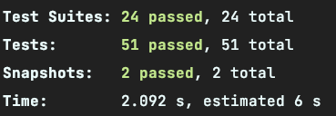

# Jest 性能优化

首先，非常感谢能看到最后，这本指南也快到尾声了。同时，你应该也积累了不少测试文件，你会发现跑这十几个测试用例变得越来越慢了，动辄一两分钟。而这些测试一般是单测或者集成测试，不应该跑这么慢的。所以，这一章来聊聊 Jest 的性能优化。

## Jest 的架构

要解决 Jest 的性能问题，我们得了解一下 Jest 是怎么运行的。之前偶然在 [YouTube]() 上看到 Jest 作者非常详细地讲述整个 Jest 执行流程，英语比较好的同学可以直接看这个视频进行了解，我这里做一个简单的搬运。


从这个图上可以看到，最影响 Jest 性能的有 3 个地方：

1. **使用 `jest-haste-map` 生成虚拟文件系统。**
2. **多线程执行测试任务。**
3. **转译 JavaScript 代码。**

## 虚拟文件系统

我们都知道在做热更新的时候，如果每次修改文件后，脚手架都要遍历一次项目文件是特别损耗性能的，特别在一些内部包含多个项目的单个项目中（Monorepo），
分分钟让电脑卡得动不了。

为了解决这个问题，Facebook 团队就想到了一个方法 —— 生成虚拟文件系统。原理很简单：在第一次启动时遍历整个项目，把文件存储成 Map 的形式，
之后文件做了改动，那么只需增量地修改这个 Map 就可以了。他们把这个工具命名为 Haste Map，中文翻译可以理解为快速生成 Map 的东西（这名字真的不好）。

这种思路不仅可以放在热更新场景里，还能应用在所有要监听文件改动的场景，其中就是 `jest --watch` 这个场景。因此，上面图中执行刚开始的时候，
Jest 会用 `jest-haste-map` 生成一次虚拟文件系统，这样后续的过滤、搜索文件就非常快速了。

所以，你会发现在跑第一个测试用例的时候，速度比较慢，原因就是在生成虚拟文件系统。这一步我们无法优化。

## 多线程

Jest 还有一个非常强大的功能，利用 Node.js 的 Worker 开启多个线程来跑测试用例。对于一些大型项目（有几千个测试用例）来说，这能提升不少效率。

但是线程不是越多越好的，每开一个线程都需要额外的开销。如果不做任何配置，那么 Jest 默认最大的 Worker 数是 `CPU 数 - 1`。其中的 `1` 是用于跑 `jest-cli`，
剩下的都拿来跑测试用例。由于之前我们一直没有对 `maxWorkers` 进行配置，所以默认会用最多的 Worker，跑这么几十个简单的测试会非常慢。

实际上，对单测和简单的集成测试来说，单个用例速度应该要做到非常快的，尽量不写一些耗时的操作，比如不要加 `setTimeout`，`n` 个 `for` 循环等。
所以，理论上来说这样的测试数量不多的情况下，单线程就足够了。这里我们可以把 `jest.config.js` 配置改为用单线程：

```js
// jest.config.js
module.exports = {
  maxWorkers: 1
}
```

在流水线中，Jest 也推荐使用单线程来跑单测和集成测试：`jest --runInBand`，其中 `runInBand` 和 `maxWorkers: 1` 效果是一样的。
下面看看多线程和单线程的对比：


**注意：我试了一下在以前的 Intel Mac 里单线程耗时只有多线程的一半，而 M1 的 Mac 上则是相反。所以，还是要自己的机器的情况来决定使用多少个 Worker。**

## 文件转译

最后一个可优化点就是转译速度（图中第 11 步）。需要注意的是 Jest 是会边执行测试用例边转译 JavaScript。

有的同学会问了：既然 Jest 刚开始就做了遍历来生成虚拟文件系统，为什么不顺便把转译的工作做了呢？**当然是因为慢了。** 
首先，对于很多业务项目来说，测试并不会很多。可能就测几个 `utils` 下的函数，那如果整个项目都转译一次，这样会把很多没用到测试的业务代码也转译。

可能这些同学还不甘心：那可以在拿到测试文件后，找到这些文件的依赖，直接一波它们给转译（在第 7，8 步）了，然后再执行测试呀？理论上是可以的。但是，
JavaScript 引入模块的方式实在是太多了，先不说 `amd`, `es6`, `umd`, `cmd`, `abcd` 这么多的引入方式了，单单这个就很难搞：

```ts
// ├── index.ts
// └── instances
//     ├── api1.ts
//     ├── api2.ts
//     ├── api3.ts
//     └── api4.ts

// index.ts
const services = (require as any).context('./instances', false, /.*/)

console.log(services); // api1, api2, api3, api4
```

因此，通过文件找依赖的方式有太多不确定性了，最终 Jest 还是决定执行到那个文件，再做转译。

原理说完了，我们来看看怎么提高转译效率。在前面的章节里，我们说到当今 JavaScript 有很多种，不仅可以用 `tsc` 和 `babel` 来转，
还能用别的语言写的转译器 `swc` 以及 `esbuild` 来转。

如果想用 `esbuild` 做转译，可以看 [esbuild-jest](https://github.com/aelbore/esbuild-jest) 这个库。这里我用 [@swc/jest](https://swc.rs/docs/usage/jest) 做例子，
先安装依赖：

```shell
npm i -D @swc/core @swc/jest
```

然后在 `jest.config.js` 里添加：

```js
module.exports = {
  // 不用 ts-jest
  // preset: "ts-jest", 

  transform: {
    // 使用 swc 转译 JavaScript 和 TypeScrit
    "^.+\\.(t|j)sx?$": ["@swc/jest"],
    // 静态资源 stub 转译
    ".+\\.(css|styl|less|sass|scss|png|jpg|ttf|woff|woff2)$":
      "jest-transform-stub",
  },
}
```

大功告成，配置非常简单，我们来看看使用 `ts-jest` 以及 `@swc/jest` 两者的对比：




## 总结

这一章里我们学到了 Jest 的整体架构，其中有 3 个地方比较耗性能：

1. 生成虚拟文件系统，在跑第一个测试会很慢
2. 多线程，生成新线程耗费的资源
3. 文件转译，Jest 会在执行到该文件再对它进行转译

解决的方法有：
1, 无解，要么拆解项目吧
2. 用例少使用单线程，当用例非常多的时候再用多线程
3. 可使用 `esbuild-jest` 以及 `@swc/jest` 其它转译工具来做转译
