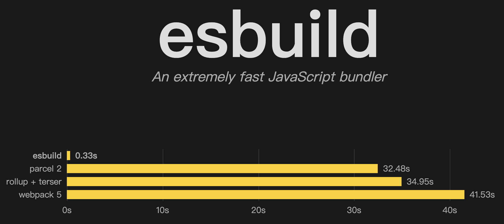
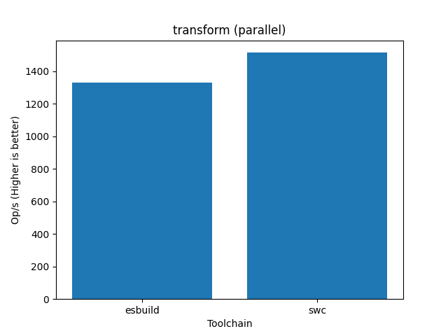

# 转译器

如今 2022 年，无论我们是写业务代码还是测试代码，都会用比较高级的 JavaScript 语法，甚至是 TypeScript。而 `jest` 本身不会做代码转译工作，
在执行测试时，它会调用别人的 **转译器/编译器** 来做代码转译。在前端，我们最熟悉的两个转译器就是 [Babel](https://babeljs.io/) 以及 [TSC](https://www.typescriptlang.org/) 了。

下面我们就以 `Jest x TypeScript` 为例子来讲如何对测试代码做转译吧。

## Babel 转译

> 本教程会使用第二个方法：使用 `ts-jest` 来转译，下面权当了解就好。

目前我在写 TypeScript 时，用 Babel 不是很多，这里我就直接搬运 [官网的教程](https://jestjs.io/docs/getting-started#using-typescript-via-babel) 了：

```shell
npm i -D @babel/preset-typescript
```

在 `babel.config.js` 里添加 TypeScript 的转译包：

```js
// babel.config.js
module.exports = {
  presets: [
    ['@babel/preset-env', {targets: {node: 'current'}}],
    '@babel/preset-typescrjjjipt',
  ],
};
```

我看到官网到这里就完了，以前我用的是需要先安装 [babel-jest](https://www.npmjs.com/package/babel-jest) ，再在 `jest.config.js` 里添加对 `.js` 以及 `.ts` 的转译的：

```shell
npm i -D babel-jest
```

```js
// jest.config.js
module.exports = {
  "transform": {
    "\\.[jt]sx?$": "babel-jest"
  },
}
```

使用 Babel 做转译不好的地方就是，无法做类型检查，所以更推荐大家使用 `ts-jest`，利用 `tsc` 来转译 TypeScript。

## TSC 转译

首先安装 [typescript](https://www.npmjs.com/package/typescript) ：

```shell
npm i -D typescript@4.6.3
```

在安装 `typescript` 时，也会同时安装 `tsc`，下面用它来初始化转译配置：

```shell
npx tsc --init
```

这会在根目录创建一个 `tsconfig.json` 文件：

```json
{
  "compilerOptions": {
    "target": "es2016",
    "module": "commonjs",
    "esModuleInterop": true,
    "forceConsistentCasingInFileNames": true,
    "strict": true,
    "skipLibCheck": true
  }
}
```

现在安装 [ts-jest](https://kulshekhar.github.io/ts-jest/) ：

```shell
npm i -D ts-jest@27.1.4
```

> **注意，这里 `ts-jest` 一定要和 `jest` 的大版本一致！比如 27 对 27，或者 26 对 26，否则会有兼容问题！**

在 `jest.config.js` 里添加一行配置：

```js
module.exports = {
  preset: 'ts-jest',
  // ...
};
```

把 `sum.js` 改成 `sum.ts`：

```ts
// sum.ts
const sum = (a: number, b: number) => {
  return a + b;
}

export default sum;
```

把 `sum.test.js` 改成 `sum.test.ts`：

```ts
import sum from '../../src/utils/sum';

describe('sum', () => {
  it('可以做加法', () => {
    expect(sum(1, 1)).toEqual(2);
  });
})
```

不过，改完后你会发现有很多的报错：


## Jest 的 TS 类型

上面的报错是因为 TS 找不到 `describe` 和 `it` 的定义，所以我要装对应的类型声明：

```shell
npm i -D @types/jest@27.4.1
```

> 同时地，TS 声明类型包的大版本最好和 `jest` 一样。

然后在 `tsconfig.json` 里加上 `jest` 和 `node` 类型声明：

```json
{
  "compilerOptions": {
    "types": ["node", "jest"]
  }
}
```

最后再执行 `npm run test` 发现也能测试通过。

## 更多转译器

还记得开头说的么？Jest 本身不做转译，而是利用别的转译器的能力来转译。所以，除了用 `babel` 和 `tsc` 转译，
我们还能用现在非常火的 [esbuild](https://esbuild.github.io/) 和 [swc](https://swc.rs/docs/getting-started) 来做转译。

顺便说一下，`esbuild` 是 [Golang](https://go.dev/) 写的一个转译器，速度巨快：



它和 `jest` 配合使用的包是 [esbuild-jest](https://github.com/aelbore/esbuild-jest) 。

而 `swc` 则是 [Rust](https://www.rust-lang.org/) 写的一个转译器，速度更快：



它和 `jest` 配合使用的包是 [@swc/jest](https://swc.rs/docs/usage/jest) 。

不过，速度只是一方面，`jest` 在构建测试环境的时会使用非常多 Tricky，Hacky 的方法，这些转译器不一定都支持这些骚操作。
而且像 `swc` 这种要用到相对底层 API 的转译工具， 不同平台的兼容性方面也有待考量，所以使用这些转译器是有一定的风险的。

目前来说，大家把它们作为一种实验品来玩，实在不行回退到 `babel` 和 `tsc` 也很简单。

## 路径简写

看到这里，你的这个测试满意了么？反正我还不满意，为啥我要写一句 `../../src/utils/sum` 这么长的路径？我写成 `utils/sum` 不是更香？

要实现这样的效果，我们可以在 `moduleDirectories` 添加 `"src"`：

```js
// jest.config.js
module.exports = {
  moduleDirectories: ["node_modules", "src"],
  // ...
}
```

这样一来 `jest` 就能看懂 `utils/sum` 对应的是 `../../src/utils/sum`，但是，`tsc` 看不懂呀：


我们还得在 `tsconfig.json` 里指定 `paths` 路径：

```json
{
  "compilerOptions": {
    "paths": {
      "utils/*": ["src/utils/*"]
    }
  }
}
```

解释一下，所谓的"路径简写"本质上就是路径的 Mapping，所以 `tsconfig.json` 里的 `paths` 就是把 `utils/xxx` 对应到 `src/utils/xxx`，
而 `jest.config.js` 里的 `moduleDirectories` 稍微狠一点，把你写的 `utils/sum` 当作第三方模块，先在 `node_modules` 里找，找不到再从 `src/xxx` 下去找。
所以这两者是有区别的。

有的同学可能并不会这么写，而是用别名作为路径开头：`import sum from "@/utils/sum"`。根据路径匹配，`tsconfig.json` 配置的很简单：

```json
{
  "compilerOptions": {
    "paths": {
      "@/*": ["src/*"]
    }
  }
}
```

但 `jest` 就不能再用 `moduleDirectories` 了，也得用路径匹配，可以使用 `moduleNameMapper`，这也是使用频率非常高的一个配置：

```js
// jest.config.js
modulex.exports = {
  "moduleNameMapper": {
    "@/(.*)": "<rootDir>/src/$1"
  }
}
```

那有的同学就会问了：难道每次写路径匹配规则都在 `tsconfig.json` 和 `jest.config.js` 写两份么？**很遗憾，确实如此。造成这个问题的主要原因是 `jest` 根本不管 `tsc`。**
不过，好消息是，你可以用 `ts-jest` 里的工具函数 `pathsToModuleNameMapper` 来把 `tsconfig.json` 里的 `paths` 配置复制到 `jest.config.js` 里的 `moduleNameMapper`：

```js
// jest.config.js
const { pathsToModuleNameMapper } = require('ts-jest/utils')
const { compilerOptions } = require('./tsconfig')

module.exports = {
  // [...]
  moduleNameMapper: pathsToModuleNameMapper(compilerOptions.paths /*, { prefix: '<rootDir>/' } */),
}
```

相信看到这的你会觉得 JS 的单一原则是不是太过分了？连这么简单的一个函数都要通过第三方的 `ts-jest` 来提供？其实，`webpack` 的配置也不读 `tsconfig.json`，
所以，不仅要在 `tsconfig.json` 里写一份路径映射，还要在 `webpack.config.js` 里再写一份，[详见这里](https://stackoverflow.com/questions/40443806/webpack-resolve-alias-does-not-work-with-typescript) 。

**这里我将用配置 `moduleDirectories` 的那个例子作为我们实战的标准配置。当然，你也可以选择 `moduleNameMapper`。**

## 总结

这一章，我们了解到了 `jest` 与转译器的关系，`jest` 本身不做任何转译，只是利用了别人转译器的能力来做代码转译。
常见的转译器有 `babel`, `tsc`, `esbuild` 和 `swc`，后面两个速度较快，同时存在一定风险，
推荐使用 `ts-jest`，后面会用 `@swc/jest` 作为实验品带大家体验一下。

转译还有另一个重要的点就是路径匹配，由于 `jest` 不做转译，所以转译时需要在 `tsconfig.json` 里做别名的路径匹配，
而且 `jest` 也要做路径匹配，可以通过配置 `moduleDirectories` 和 `moduleNameMapper` 来实现。
